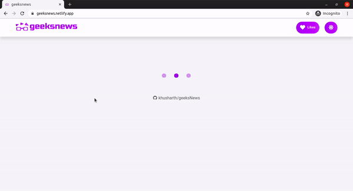

<p align="center">
    
    <br>
    <br>
     <a href="https://app.netlify.com/sites/geeksnews/deploys"></a>

</p>
A web app which shows the top news :newspaper: related to computer science and entrepreneurship from the Hacker News API. :computer:
 

## :film_projector: DEMO
<p align="center">

</p>


## :man_technologist: Technology Stack


* [React](https://reactjs.org/)
* [Redux](https://redux.js.org/)
* [Styled-components](https://styled-components.com/)
* [React Icons](https://react-icons.github.io/react-icons/)

### API used
* For getting top stories : [Hacker News API](https://github.com/HackerNews/API)

## :hatching_chick: Prerequisites
* [node](https://nodejs.org/en/) >= 12.18.0
* npm >= 6.14.4

## :zap: Installation

1. Clone / Download [this](https://github.com/khusharth/geeksNews) repo.
2. Inside the project open a terminal and run:
    ```
    npm install
    ```
    This will install all the project dependencies.

3. To start the development server run:
    ```
    npm start
    ```

## :man_in_tuxedo: Author
[](https://twitter.com/khusharth19) 

[](https://www.linkedin.com/in/khusharth/)


